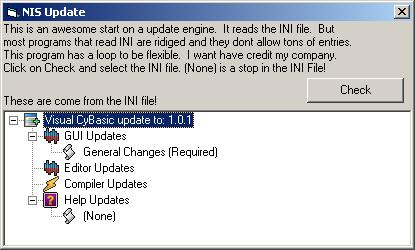



## \_NIS Updater \- Reads INI To Tree View\!\!\!\!

### Description

This code does a lot. It has a function to read INI files. Then puts the information into a tree view! Its flexible, so it can have 99 or 2000 things in the tree view with out chaning the code. Once (None) is placed, it stops. Awesome!
 
### More Info
 

             |
---                |---
**Submitted On**   |2001-11-21 19:27:02
**By**             |[The New iSoftware Company\!](https://github.com/Planet-Source-Code/PSCIndex/blob/master/ByAuthor/the-new-isoftware-company.md)
**Level**          |Advanced
**User Rating**    |4.0 (20 globes from 5 users)
**Compatibility**  |VB 6\.0
**Category**       |[Math/ Dates](https://github.com/Planet-Source-Code/PSCIndex/blob/master/ByCategory/math-dates__1-37.md)
**World**          |[Visual Basic](https://github.com/Planet-Source-Code/PSCIndex/blob/master/ByWorld/visual-basic.md)
**Archive File**   |[\_NIS\_Updat3661111212001\.zip](https://github.com/Planet-Source-Code/the-new-isoftware-company-nis-updater-reads-ini-to-tree-view__1-29080/archive/master.zip)

